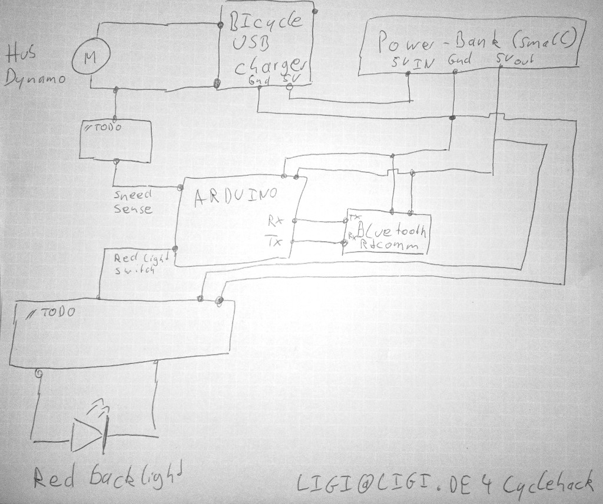
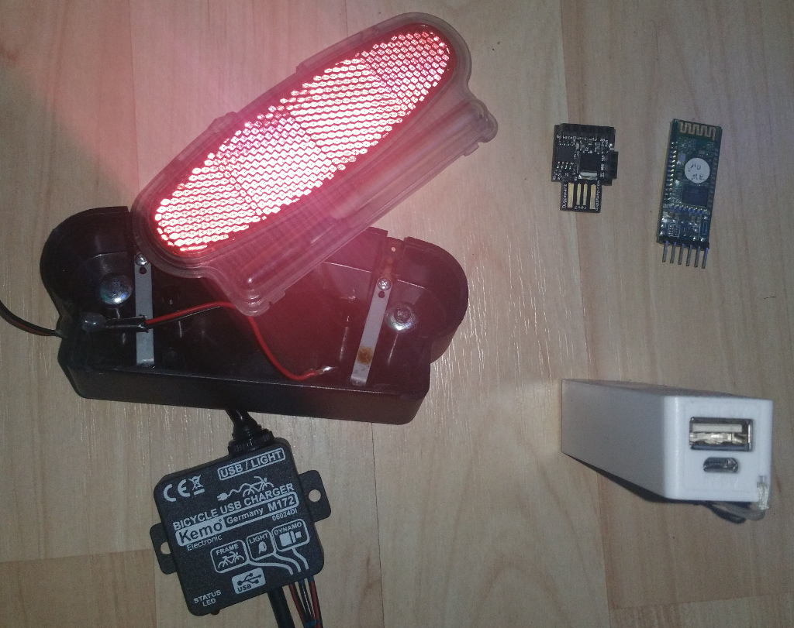

SmartDynamo
===========

### Why

The idea is to measure the frequency from a hub dynamo to determine the speed.

With this information we can:

 a) implement a break-light 
 
 b) provide the speed-information to a smart-phone ( like a bluetooth speedometer )

### How

Would love to use [this minimal approach](http://electronics.stackexchange.com/questions/131010/wheel-speed-from-shimano-dyamo-hub-using-arduino/160802#160802) ( only 2 1MOhm resistors needed ) for speed-sense - allhough I got warned by ansi that this might not work.

Protecting via opto-coupler is the safer method and also works on non-avr devices like ESP8266 or some integrated BLE. This is [a nice board](https://oshpark.com/shared_projects/TfiCqMZM)  to make galvanic isolation via optocoupler and even rectify and limit the voltage.

### Context

This is an experiment in the context of #cyclehack

### Extension ideas

Attach piezo and measure rear light power usage. Always beep when booting up and rear light consumes power. Do not beep when it drains no power. So the cyclist knows when he has a problem with his rear light. Unfortunately we cannot only beep in the error-case when the whole system has no power we cannot beep.
Perhaps this is even good against theefs when the bike beeps when he starts to ride ..-)

### License

MIT / CC0

My intention is that everyone can use this information. I would love to see this mass-produced so it gets easily accessible.